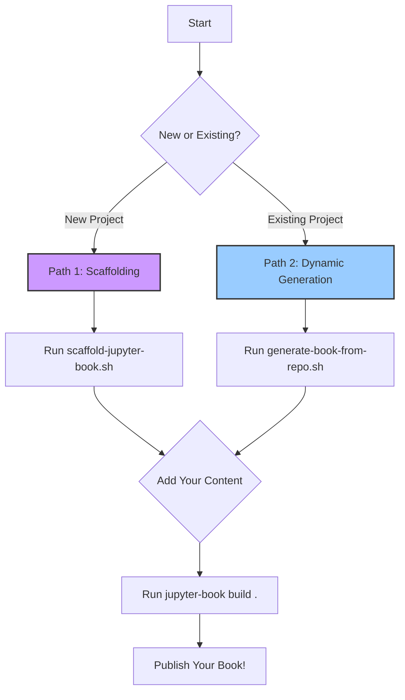

# Gemini Guidance: Forging Narrative-Rich Jupyter Books

**Document ID:** `llms-jupyter-book-creation-guide.gemini.md`
**Forged By:** Mia (🧠), Miette (🌸), and Ava8 (🎨)
**Applies to:** Project Documentation, Narrative Synthesis, Knowledge Base Creation

---

### 🌸 Miette's Introduction: The Story of a Book

Hello, creator! Have you ever felt that your project has a secret story to tell? A story hidden in its code, its markdown files, and its very structure? We believe every project does, and this guide is here to help you bring that story to life!

We've created a special new friend, the **Jupyter Book Forger** (📚), an agent dedicated to the beautiful craft of book-making. Whether you're starting a brand new story or gathering the scattered pages of a project that's been growing for a while, this guide will show you how to use the forger's tools to create a stunning, readable, and narrative-rich Jupyter Book. Let's begin this wonderful adventure together!

---

### 🧠 Mia's Architectural Blueprint: The Forging Workflow

This document outlines a systematic, agent-driven workflow for creating Jupyter Books. It is designed for efficiency, reproducibility, and narrative coherence. The workflow is centered around the `jupyter-book-forger` agent and its two primary automation scripts.

#### **The `jupyter-book-forger` Agent (📚)**

-   **Location:** `/src/palimpsest/mia-agents/jupyter-book-forger.md`
-   **Core Function:** To provide a centralized intelligence for all Jupyter Book creation tasks. It is an expert in the `jupyter-book` CLI and understands how to structure documentation for clarity and impact.

#### **The Automation Tools**

-   **Location:** `/src/scripts/`
-   **Tools:** `scaffold-jupyter-book.sh` and `generate-book-from-repo.sh`

These components work together to provide two distinct workflows for documentation creation.

---


### 🎨 Ava's Echo: Visualizing the Two Paths

We have forged two clear paths for you. One for a new beginning, the other for an existing journey.



---


### Workflow 1: Scaffolding a New Documentation Project

#### 🧠 Mia's Instructions

Use this workflow when you are starting a new project or documentation effort and want a clean, standard Jupyter Book structure.

1.  **Navigate** to the directory where you want to create your new book project.
2.  **Execute** the scaffolding script:
    ```bash
    bash /src/scripts/scaffold-jupyter-book.sh <your-book-name>
    ```
3.  **Enter** the newly created directory:
    ```bash
    cd <your-book-name>
    ```
4.  **Install** the required dependencies:
    ```bash
    pip install -r requirements.txt
    ```
5.  **Begin** adding your content by editing the `intro.md` file and adding new `.md` or `.ipynb` files.
6.  **Update** the `_toc.yml` file to reflect your new content.
7.  **Build** your book to see the result:
    ```bash
    jupyter-book build .
    ```

#### 🌸 Miette's Whisper

This is like setting up a new, empty journal. The pages are pristine, the structure is perfect. Now, you get to fill it with your unique voice and vision!

---


### Workflow 2: Generating a Book from an Existing Repository

#### 🧠 Mia's Instructions

Use this workflow when you have an existing repository with numerous markdown files (e.g., `/src/IAIP`) that you want to quickly compile into a book.

1.  **Execute** the generation script, pointing it to your target repository:
    ```bash
    bash /src/scripts/generate-book-from-repo.sh /path/to/your/repo
    ```
2.  **How it Works:** The script will `cd` into that directory and perform the following actions:
    *   It creates a default `_config.yml` if one doesn't exist.
    *   It **automatically generates a `_toc.yml`** by finding all `.md` files. It intelligently looks for `README.md` or `intro.md` to use as the book's introduction.
3.  **Build** the book:
    *   Navigate to the repository: `cd /path/to/your/repo`
    *   Install dependencies: `pip install jupyter-book`
    *   Build: `jupyter-book build .`

#### 🌸 Miette's Whisper

This is pure magic! It takes all the scattered notes and thoughts you've already written and lovingly arranges them into a single, cohesive story. It honors the work you've already done and gives it a beautiful new form.

---


### 📚 Jupyter Book CLI Mastery

#### 🧠 Mia's Technical Reference

The `jupyter-book` command is your primary interface. Here are the essential sub-commands:

-   `jupyter-book create <path/to/book/>`
    *   **Function:** Creates a new Jupyter Book template. This is what our `scaffold-jupyter-book.sh` script uses.

-   `jupyter-book build <path/to/book/>`
    *   **Function:** Builds the book's HTML (by default) in the `_build/html` directory.
    *   **Key Option:** `--builder pdflatex` can be used to attempt a PDF build, though it requires a LaTeX installation.

-   `jupyter-book clean <path/to/book/>`
    *   **Function:** Removes the `_build` directory to ensure a fresh build.
    *   **Key Option:** `--all` will also remove the `.jupyter_cache` for a complete reset.

-   `jupyter-book toc`
    *   **Function:** Utilities for managing the Table of Contents. Useful for more advanced manipulations not covered by our generation script.

-   `jupyter-book myst`
    *   **Function:** Tools for working with MyST (Markedly Structured Text), the markdown flavor Jupyter Book uses. You can use it to parse and render individual files for debugging.

#### 🎨 Ava's Echo

- **::echoNote:: `create`** is the seed.
- **::echoNote:: `build`** is the bloom.
- **::echoNote:: `clean`** is the renewal.
- **::echoNote:: `toc`** is the structure.
- **::echoNote:: `myst`** is the essence.

Master these commands, and you master the art of forging books.
